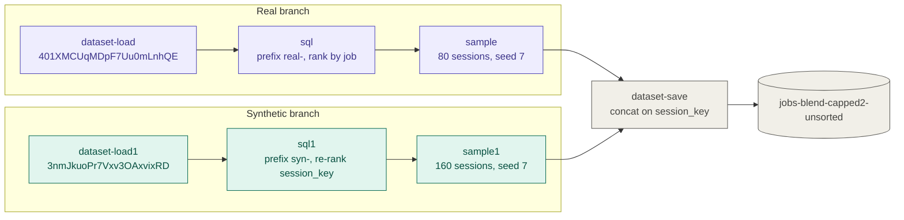

# Blend data

Combine several datasets that describe the same kind of thing into one dataset — e.g. real `jobs` sessions plus synthetic `jobs` sessions — so the result can be trained on, evaluated, or shipped as a single table. Blending is **row-wise** (stack sessions from every input); joining columns is a different job (use `ra.SQL` with a `JOIN`).

The reference implementation, [`reference/blend.py`](reference/blend.py), does the whole flow and is verified end-to-end against a Rockfish backend. Read it before writing blend code; adapt it rather than starting from scratch.

## When to use this skill

- The user has two or more dataset IDs (or names) with the same logical schema and wants **one** dataset out.
- Mixing **real and synthetic** sessions, or several synthetic runs, possibly at a chosen ratio ("80 real jobs + 160 synthetic").
- The user asks why `DatasetSave(concat_tables=True)` with multiple parents failed or produced odd session keys.

Not for: column-wise joins, deduplicating overlapping records, or schema-less appends of unrelated tables. If inputs need real data prep (renames, unit changes, type fixes), do that first — the blend assumes one schema.

## Concept

A blend is a DAG with one branch per input converging on one sink:

```
DatasetLoad(A) → SQL(align A) [→ Sample] ─┐
DatasetLoad(B) → SQL(align B) [→ Sample] ─┼→ DatasetSave(concat_tables=True, concat_session_key="session_key")
...                                        ─┘
```

`DatasetSave` saves the first table that reaches it and **appends** every later one to that dataset. When a session key is configured it adds a running offset to each appended table's key, so sessions from different inputs never share a key. Everything the branches emit must therefore have an **identical schema** and an **int64 session key** — the align SQL guarantees both.

Two things the sink cannot do: validate the inputs against each other (it just fails on append), and sort (it never knows when the last parent is done). So validation happens *before* the workflow, and ordering is a second pass.

## Steps

The skill's reference script runs these in order; each maps to a function in `blend.py`.

1. **Inspect** (`inspect_source`) — for each input run `SELECT * FROM my_table LIMIT 0` via `RemoteDataset.sql(query, conn=conn)`. That returns the Arrow schema *and* the schema metadata without downloading rows. Read `source_metadata.session_field`: generated datasets carry one (e.g. `session_key`), and it can be finer than the entity id — in the `jobs` example, synthetic data has 85 distinct `job` values across 160 sessions. Use that field as the session basis for that input; otherwise use a `session_key` column if there is one (an earlier blend has one, but its metadata doesn't name it), and fall back to the user's entity field last. Count rows and sessions with the same SQL call.
2. **Validate** (`validate`) — compare schemas field by field, treating `string`/`large_string` (and `binary`/`large_binary`) as equal since parquet round trips flip them; the align SQL then casts both to `Utf8` (`Binary`) so the branches really match. Rules:
   - A shared field with different types on different inputs → **stop**. Tell the user which field and types; the fix is data prep (`ra.SQL` `CAST`, `ra.CoerceDtypes`, renaming), not the blend.
   - The time field and entity field must exist in every input, with no NULLs in either. The entity field needs one type across inputs. The time field may be a timestamp of any unit/timezone or an ISO 8601 string (`generate-from-schema` emits strings); the align SQL casts every input to one type with `arrow_cast` — the first input's timestamp type, or `timestamp[us, UTC]` if all are strings. `arrow_cast` fails the whole query on one unparseable string, so count `TRY_CAST(ts AS TIMESTAMP) IS NULL` rows server-side first (`check_time_strings`) and stop before any workflow starts.
   - Fields not shared by every input are dropped by default (report them); offer `--on-extra fail` when silently losing a column is unacceptable.
   - Do this before starting any workflow — a failed blend leaves partial datasets behind.
3. **Align** (`align_query`) — one `ra.SQL` per branch that projects the common fields in one fixed order, each wrapped in `NULLIF(<expr>, NULL)`, and adds the columns below. The wrapper returns the value unchanged but is always nullable, so inputs that agree on types but not on nullability still produce identical branch schemas.
   - **Namespaced entity ids**: `'<tag>-' || job` for string ids. Real and synthetic data routinely reuse the same ids (`J00137` in both); without a prefix, anything that groups by `job` merges unrelated sessions. Tags must be unique and contain no `-`, or the prefix is ambiguous (`prod` + `west-1` and `prod-west` + `1` both give `prod-west-1`). Integer ids can't take a prefix without changing type, so shift each input into its own range instead (`device_id + <shift>`, with shifts computed from each input's `MIN`/`MAX`; see `assign_id_shifts`). Skip only when the ids are known to be disjoint. An entity field named `session_key` needs neither: it is replaced by the regenerated key.
   - **A provenance column** (`blend_source = '<tag>'`), on by default — it makes the verify step and later per-source evaluation trivial. Omit it if the downstream consumer requires the exact source schema.
   - **A fresh int64 session key**: `CAST(DENSE_RANK() OVER (ORDER BY <session basis>) - 1 AS BIGINT) AS session_key`. It is 0-based and dense per branch, which is what `DatasetSave`'s offsetting expects, and it overwrites any stale key from the input.
4. **Mix** (optional) — to control the ratio, add `ra.Sample(session_key="session_key", sample_size=N, sample_type="random", seed=S)` after a branch's align step. With `session_key` set, `sample_size` counts **sessions**, not rows, so whole sessions are kept intact. `Sample` raises when `sample_size` exceeds the sessions available (without `replace=True`), so clamp each cap to that input's session count. Once any branch is sampled, sample **every** branch (uncapped ones at their full session count): `Sample` rewrites column nullability, and a branch without it no longer matches the others on append.
5. **Blend** — `builder.add_path(load, align[, sample])` per input, then `builder.add_action(ra.DatasetSave(name=..., concat_tables=True, concat_session_key="session_key"), parents=[...tails])`. Always pass `concat_session_key` (see pitfalls).
6. **Sort** — a second workflow: `builder.add_path(blended_remote_dataset, ra.SQL(query="SELECT * FROM my_table ORDER BY ts, session_key"), ra.DatasetSave(name=...))`. The first workflow's output stays behind as an intermediate; tell the user its ID rather than deleting it unasked.
7. **Verify** (`verify`) — server-side SQL on the result:
   - row count equals the sum of inputs (skip when sampling);
   - distinct `session_key` equals the sum of per-input sessions (or the caps);
   - no `session_key` spans more than one `blend_source`;
   - per-source row/session counts;
   - the time column is non-decreasing (pull just that column with `SELECT ts FROM my_table`).

   Report these numbers to the user; don't claim success on a completed workflow alone.

### Example: the resulting workflow

The blend workflow built by `blend.py --dataset 401XMCUqMDpF7Uu0mLnhQE --dataset 3nmJkuoPr7Vxv3OAxvixRD --time-field ts --session-field job --tags real,syn --sessions 80, --seed 7`, which blends 80 real `jobs` sessions with all 160 synthetic ones. The synthetic branch has no cap but still gets a `sample` step, sized to its full 160 sessions, because a sampled and an unsampled branch don't match on append (see Pitfalls). Action names (`dataset-load1`, `sql1`, ...) are the ones the workflow logs show. The sort workflow (step 6) then reads `jobs-blend-capped2-unsorted` and writes the final dataset.



### Alternative: one SQL action (`--mode union`)

For moderate sizes, a single `ra.SQL` with `dataset_name_to_id` can do align + blend + sort in one workflow with no intermediate dataset:

```python
ra.SQL(
    table_name="t0",
    dataset_name_to_id={"t1": id_b},
    query="""
      SELECT job, ..., blend_source,
             CAST(DENSE_RANK() OVER (ORDER BY _src, _basis) - 1 AS BIGINT) AS session_key
      FROM (SELECT 'real-' || job AS job, ..., 'real' AS blend_source, 0 AS _src,
                   CAST(job AS VARCHAR) AS _basis FROM t0
            UNION ALL
            SELECT 'syn-' || job AS job, ..., 'syn' AS blend_source, 1 AS _src,
                   CAST(session_key AS VARCHAR) AS _basis FROM t1)
      ORDER BY ts, session_key""",
)
```

The first input comes from the `DatasetLoad` parent (`t0`); the rest are fetched by ID. The trade-off: the whole blend is materialized inside one action, and there is no per-branch `Sample`. Prefer the DAG for large inputs or mixing ratios; prefer `union` when the user wants one sorted dataset with no leftovers. `union_query` in `blend.py` builds this query generically.

## Pitfalls (observed on the current SDK)

| Symptom | Cause | What to do |
| --- | --- | --- |
| Blend workflow fails with `500 Internal Server Error` from `/dataset/<id>`; a dataset with only the first input's rows is left behind | Inputs with different schemas: the first table is saved, the append of the second is rejected | Validate first (step 2); route every input through the same align projection |
| `ActionError: field 'session_key' not found` in `dataset-save` after an SQL step dropped that column | `ra.SQL` re-attaches the input table's metadata to its output (`rockfish/actions/sql.py`), so a stale `session_field` survives the projection | Emit a `session_key` column in every branch and set `concat_session_key` |
| Blended sessions collide (two inputs both have session 0..n) | `DatasetSave` offsets keys only for tables whose metadata names a session field; a branch without it is appended un-offset (`rockfish/actions/dataset.py`, `run`) | Always pass `concat_session_key="session_key"` |
| `DatasetSave(drop_fields=[...])` leaves the fields in place | `drop_fields` is only honoured when `drop_default_session_key=True`, and even then only on the first upload — appended tables skip it, so the blend would then fail on append | Drop fields in the align SQL instead |
| Blend fails with the append `500` only when some branches have `Sample` and others don't | `Sample` rewrites field nullability (observed: `session_key` becomes non-null, literal columns become nullable), so sampled and unsampled branches no longer match | Put `Sample` on every branch or none |
| Blended output isn't ordered by time | Tables are appended in arrival order, which depends on which branch finishes first | Sort pass (step 6) or `--mode union` |
| Fewer sessions than expected after the blend | `DatasetSave` trims to `desired_count` from the table metadata, and `SQL` carries one input's metadata forward — so a generated input's count can reach the union SQL's or the sort pass's save and trim the whole blend | Reject inputs whose metadata has `desired_count` during inspection; re-save them without it (`meta = local.table_metadata(); meta.desired_count = None; await local.with_table_metadata(meta).to_remote(conn)`) |
| `COUNT(DISTINCT job)` is lower than the session count | Synthetic generators can reuse entity ids across sessions | Base the session key on the input's metadata `session_field` (step 1), and namespace ids |

## Running the reference

```bash
python skills/blend-data/reference/blend.py \
    --dataset <id_a> --dataset <id_b> \
    --time-field ts --session-field job \
    --tags real,syn --name jobs-blended
```

Useful flags: `--dry-run` (inspect, validate, and print the align SQL without starting a workflow — run this first), `--sessions 80,160 --seed 7` (per-input session caps), `--mode union`, `--source-field ''` (omit provenance), `--no-namespace`, `--on-extra fail`, `--profile <name>|env`. Inputs are given by ID; find IDs with `conn.list_datasets()` and check each candidate's schema with the `LIMIT 0` query before proposing a pair.

Connection: `rf.Connection.from_config()` reads `~/.config/rockfish/config.toml`; `rf.Connection.from_env()` reads `ROCKFISH_API_KEY` / `ROCKFISH_API_URL` / `ROCKFISH_PROJECT_ID` / `ROCKFISH_ORGANIZATION_ID`.
